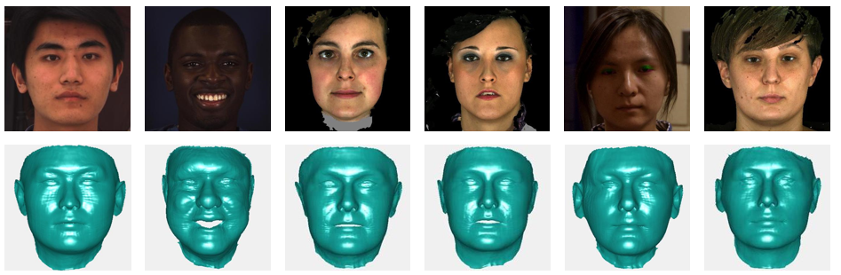
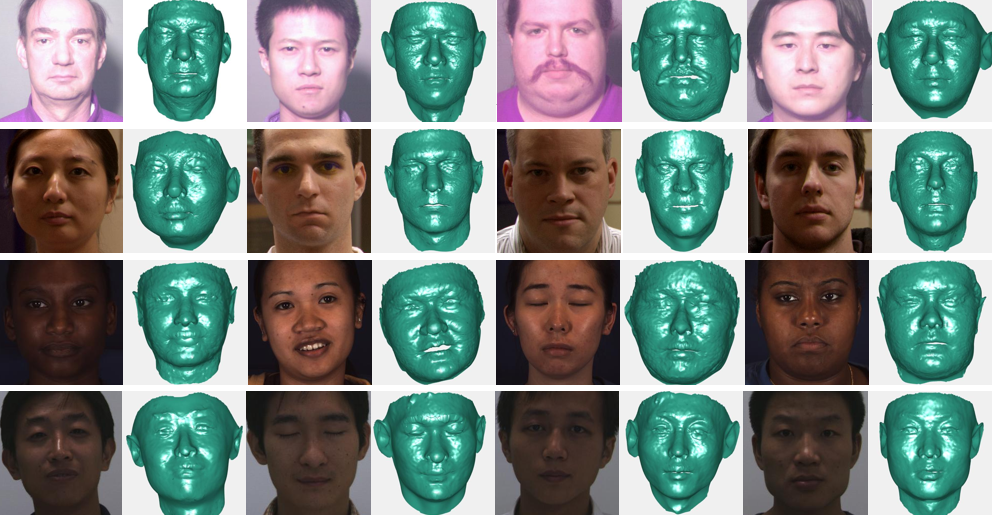

# Beyond 3DMM Space: Towards Fine-grained 3D Face Reconstruction

<p align="center">
  
</p>


**\[Updates\]**
 - The code and model of FGNet is released.
 - The dataset of FG3D is released.

## Introduction
This repo releases the code and data in the paper published in ECCV 2020: Beyond 3DMM Space: Towards Fine-grained 3D Face Reconstruction (http://www.cbsr.ia.ac.cn/users/xiangyuzhu/papers/2020beyond.pdf). 

The reconstruction results of widely used 3DMM lose the fine-grained geometry and look different from real faces. We propose a Fine-Grained reconstruction Network (FGNet) that can concentrate on shape modification and generate reconstruction results with fine-grained geometry. 

## Getting started
### Requirements
 - PyTorch >= 0.4.1 (**PyTorch v1.1.0** is tested successfully on macOS and Linux.)
 - Python >= 3.6 (Numpy, Scipy, Matplotlib)
 - Dlib (Dlib is optionally for face and landmarks detection. There is no need to use Dlib if you can provide face bouding bbox and landmarks. Besides, you can try the two-step inference strategy without initialized landmarks.)
 - OpenCV (Python version, for image IO operations.)
 - Cython (For accelerating depth and PNCC render.)
 - Platform: Linux or macOS (Windows is not tested.)

 ```
 # installation structions
 sudo pip3 install torch torchvision # for cpu version. more option to see https://pytorch.org
 sudo pip3 install numpy scipy matplotlib
 sudo pip3 install dlib==19.5.0 # 19.15+ version may cause conflict with pytorch in Linux, this may take several minutes. If 19.5 version raises errors, you may try 19.15+ version.
 sudo pip3 install opencv-python
 sudo pip3 install cython
 ```

In addition, I strongly recommend using Python3.6+ instead of older version for its better design.

### Usage

1. Clone this repo (this may take some time as it is a little big)

2. Download the following large models to models/

   https://github.com/XiangyuZhu-open/models/blob/fdb595cc1061fefe077d2f168924430adedbfe70/_checkpoint_epoch_22.pth.tar
   https://github.com/XiangyuZhu-open/models/blob/fdb595cc1061fefe077d2f168924430adedbfe70/shape_predictor_68_face_landmarks.dat

3. Build cython module (just one line for building)
   ```
   cd MM3D/cython
   python3 setup.py build_ext -i
   ```
   This is for accelerating depth estimation and PNCC render since Python is too slow in for loop.
   
    
4. Run the `main.py` with arbitrary image as input
    ```
    python3 main.py -f examples/images/test.jpg
    ```
    If you can see these output log in terminal, you run it successfully.
    ```
	Lossy conversion from float32 to uint8. Range [0, 1]. Convert image to uint8 prior to saving to suppress this warning.
	Lossy conversion from float64 to uint8. Range [0, 1]. Convert image to uint8 prior to saving to suppress this warning.
	1/1
	There are 1 images...
	=> loading checkpoint 'models/_checkpoint_epoch_22.pth.tar'
	begin testing
	end
    ```


## Fine-grained 3D Face (FG3D) Data
<p align="center">
  
</p>

FG3D are constructed from FRGC, BP4D and CASIA-3D. We register and out-of-plane augment the three datasets, generating a large 3D dataset with 213,367 samples. Among FG3D, 90% subjects are used as the training set and the rest 10\% subjects are the testing set. 

[[BaiduYun]](https://pan.baidu.com/s/1ruqOXBljZowUxGSLg9HMiQ) (Extract Code: 4r84). [[GoogleDrive]](https://drive.google.com/drive/folders/1zmyekrHABO-eykloxM1z0TRiXTm7oM3r?usp=sharing)
